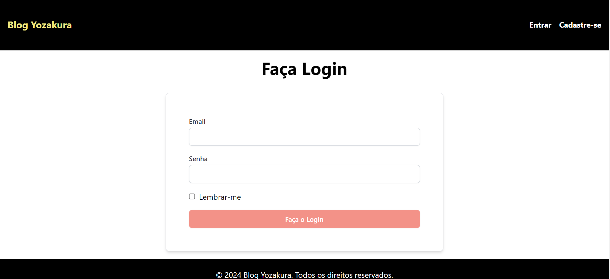
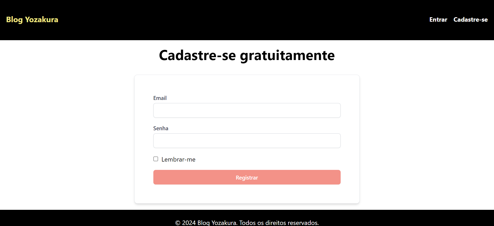
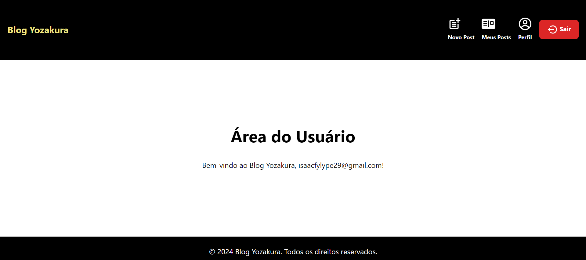
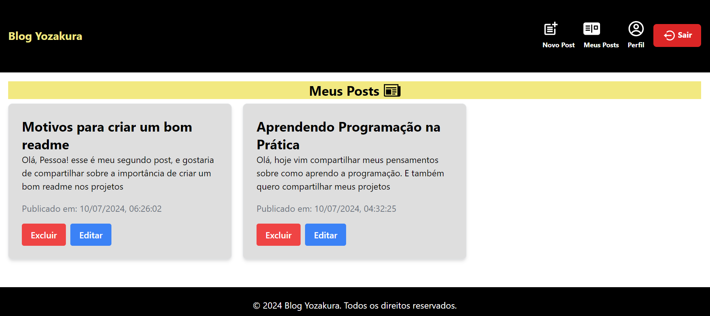

# BLOG YOZAKURA

Passos para rodar o frontend do blog YOZAKURA:

## Clonar o Repositório

Siga os passos abaixo para clonar este repositório em sua máquina local.

1. **Abra o terminal**

   - No Windows, você pode usar o Prompt de Comando ou PowerShell.
   - No macOS e Linux, você pode usar o Terminal.

2. **Navegue até o diretório onde deseja clonar o repositório**

   Use o comando `cd` para mudar para o diretório desejado. Por exemplo:

   ```sh
   cd /caminho/para/seu/diretorio
   ```
3. **clonar o repositório**
     
     ```bash
     git clone https://github.com/Hanami-Staff/yozakura.git

     ```
4. **Navegue até o diretório do projeto clonado**
```bash
   cd yozakura

```
5. **Instale as dependências necessárias usando o npm ou yarn**

```bash
   npm install  
```
6. **Iniciar o servidor de desenvolvimento**
```bash
   npm run dev  
```

Abrir o projeto em Localhost: [http://localhost:3000]

Bem-vindo ao projeto! Aqui está imagens do Blog que fizemos, o projeto está em constante desenvolvimento.
### Tela Login

### Tela de Cadastro

### Tela área do usuário

### Tela área de post do Usuário

